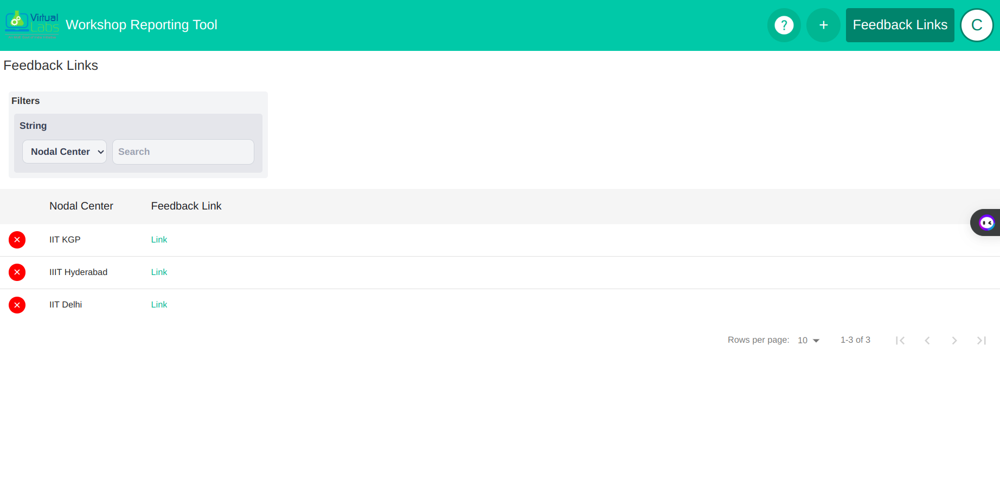

# Outreach Tool Documentation

## Quick Access

1. [Introduction](#introduction)
2. [Definitions](#definitions)
3. [User Privileges](#user-privileges)
4. [Walkthrough of the Outreach Tool](#walkthrough-of-the-outreach-tool)
   - [Logging In](#logging-in)
   - [Dashboard](#dashboard)
   - [Managing Workshops](#managing-workshops)
   - [Managing Templates](#managing-templates)
   - [Managing Users and Institutes](#managing-users-and-institutes)
   - [Managing Feedback Links](#managing-feedback-links)
   - [Logging Out](#logging-out)
5. [Support and Updates](#support-and-updates)

## Introduction

The Outreach tool is designed to facilitate the storage and management of workshop data for Virtual Labs. It allows admins and nodal coordinators from various institutes to access and maintain workshop information efficiently.

## Definitions

## User Privileges

| Operation        | Admin User | Nodal Coordinator |
| ---------------- | ---------- | ----------------- |
| Add Workshop     | Yes        | \*Yes             |
| Delete Workshop  | Yes        | \*Yes             |
| Edit Workshop    | Yes        | \*Yes             |
| Add Template     | Yes        | Yes               |
| Delete Template  | Yes        | No                |
| Add User         | Yes        | No                |
| Delete User      | Yes        | No                |
| Add Institute    | Yes        | No                |
| Delete Institute | Yes        | No                |
| View Workshop    | Yes        | \*Yes             |

\* Nodal coordinators can only view, add, delete, and edit workshops that are added by them.

## Walkthrough of the Outreach Tool

### Logging In

Upon navigating to the Outreach tool's URL, users will be presented with the login page. Users can log in using their Google credentials.

### Dashboard

After successful login, users will land on the dashboard. The dashboard provides an overview of workshops and other relevant information.

### Managing Workshops

Admin and Nodal Coordinator users can manage workshops by adding, editing, or deleting workshop records. They can also view detailed information about each workshop.

### Managing Templates

Users can utilize different templates for workshop records to streamline data entry and ensure consistency. They can add, edit, or delete templates as needed.

### Managing Users and Nodal Centers

Admin users have the privilege to add, edit, or delete user accounts and nodal center information. This allows for efficient management of user access and organization data.

### Managing Feedback Links

Admin users can add or delete feedback links for workshops. This feature allows for easy access to feedback forms and data collection.

### Logging Out

Users can log out of the Outreach tool by clicking on the logout button located in the navigation menu. This ensures the security of their account and data.

## Support and Updates

Regular updates and versioning are provided to ensure the tool's functionality and security.
