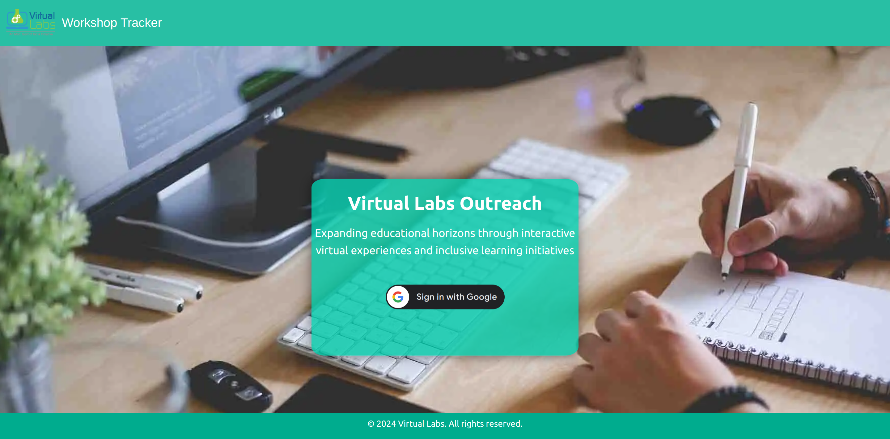
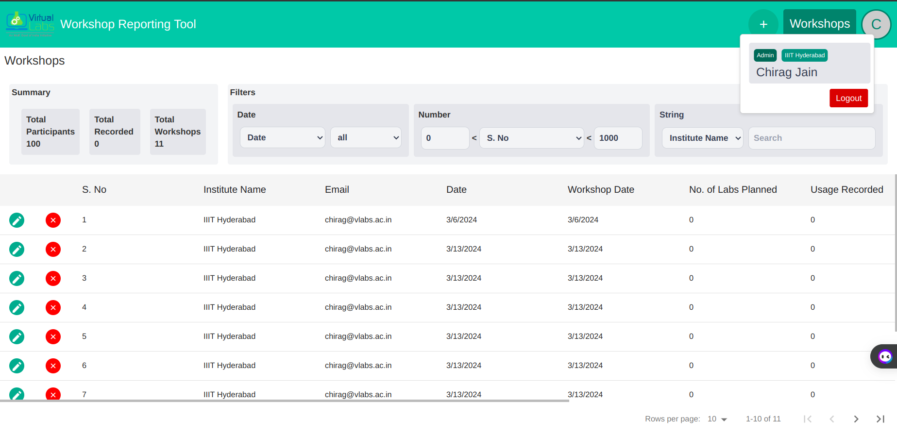
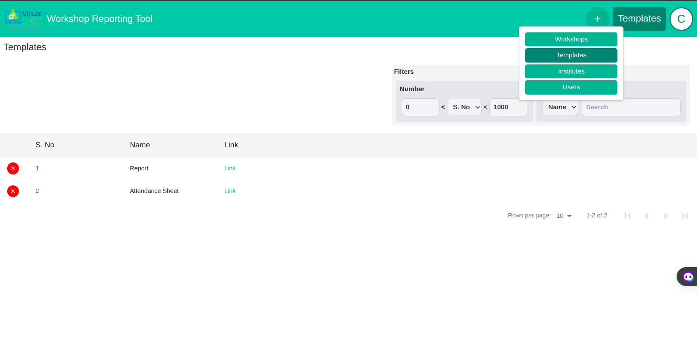
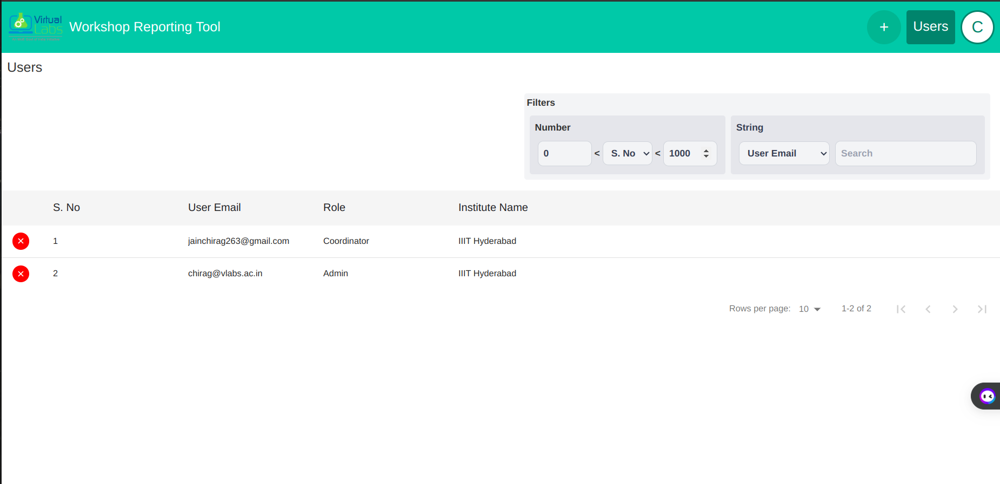

# Workshop Reporting Tool User Guide

## Table of Contents

1. [Introduction](#introduction)
2. [Features](#features)
3. [User Privileges](#user-privileges)
4. [Walkthrough of the Workshop Reporting Tool](#walkthrough-of-the-workshop-reporting-tool)
   - [Logging In](#logging-in)
   - [Dashboard](#dashboard)
   - [Managing Workshops](#managing-workshops)
   - [Viewing Templates](#viewing-templates)
   - [Viewing Institutes](#viewing-institutes)
   - [Logging Out](#logging-out)
5. [Support and Updates](#support-and-updates)

## Introduction

The [Workshop Reporting Tool](https://outreach.vlabs.ac.in/) is designed to facilitate the storage and management of workshop data for Virtual Labs. It allows nodal coordinators from various institutes to access and maintain workshop information efficiently.

## Features

- Store and manage workshop data.
- Utilize different templates for workshop records.
- Google authorization for both admin and coordinator users.

## User Privileges

| Operation        | Nodal Coordinator |
| ---------------- | ----------------- |
| Add Workshop     | \*Yes             |
| Delete Workshop  | \*Yes             |
| Edit Workshop    | \*Yes             |
| Add Template     | Yes               |
| Delete Template  | No                |
| Add User         | No                |
| Delete User      | No                |
| Add Institute    | No                |
| Delete Institute | No                |
| View Workshop    | \*Yes             |

\* Nodal coordinators can only view, add, delete, and edit workshops that are added by them.

## Walkthrough of the Workshop Reporting Tool

### Logging In

Upon navigating to the [Workshop Reporting Tool](https://outreach.vlabs.ac.in/) (@ https://outreach.vlabs.ac.in), Npdal coordinators will be presented with the login page, you can log in using their Google credentials.

### Dashboard

After successful login, Nodal coordinators will be logged into the dashboard. The dashboard provides an overview of workshops and other relevant information.

### Managing Workshops

The Nodal Coordinator can manage workshops by adding, editing, or deleting workshop records. They can also view detailed information about each workshop.

### Viewing Templates

Nodal coordinators can view different templates for workshop records to streamline data entry and ensure consistency. 

### Viewing Institutes

Nodal coordinators can view other registered Nodal centers

### Logging Out

Nodal coordinators can log out of the workshop reporting tool by clicking on the logout button located in the navigation menu. This ensures the security of their account and data.

## Support and Updates

Regular updates and versioning are provided to ensure the tool's functionality and security. For any assistance or inquiries, please contact us at ioc-iiith@vlabs.ac.in.
